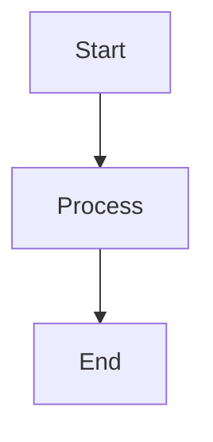

# Confluence MCP Server

A Model Context Protocol (MCP) server that enables AI assistants to interact with Confluence, converting Markdown documents to professionally styled Confluence pages with Mermaid diagram support.

## Features

- 🔄 **SSE Server**: Real-time Server-Sent Events for live progress updates
- 📝 **Markdown to Confluence**: Convert Markdown content to Confluence storage format
- 📊 **Mermaid Diagrams**: Render Mermaid diagrams as images in Confluence pages
- 🎨 **Professional Styling**: Modern, clean page layouts
- 💾 **Smart Caching**: Local cache to link markdown files to Confluence pages
- 🔒 **Secure Authentication**: Confluence API token authentication
- ☁️ **Fly.io Ready**: Optimized for deployment on Fly.io

## Tools Available

- `confluence_list_spaces` - List all available Confluence spaces
- `confluence_list_pages` - List pages in a specific space
- `confluence_create_page` - Create new pages from Markdown content
- `confluence_update_page` - Update existing pages with new content
- `confluence_delete_page` - Delete pages and clean up cache

## Quick Start

### 1. Installation

```bash
git clone <repository-url>
cd confluence-mcp
npm install
```

### 2. Configuration

Copy the example environment file and configure your Confluence credentials:

```bash
cp .env.example .env
```

Edit `.env` with your Confluence details:

```env
CONFLUENCE_BASE_URL=https://your-domain.atlassian.net
CONFLUENCE_USERNAME=your-email@domain.com
CONFLUENCE_API_TOKEN=your-api-token
MCP_API_KEY=your-mcp-api-key
PORT=3001
```

### 3. Get Confluence API Token

1. Go to [Atlassian Account Settings](https://id.atlassian.com/manage-profile/security/api-tokens)
2. Click "Create API token"
3. Give it a label and copy the token
4. Use your email as username and the token as password

### 4. Run the Server

```bash
# Development
npm run dev

# Production
npm run build
npm start
```

The server will be available at `http://localhost:3001`

## Usage Examples

### Create a Page from Markdown

```markdown
# My Documentation

This is a sample page with a Mermaid diagram:



Some **bold text** and *italic text*.
```

The MCP server will:
1. Convert the Markdown to Confluence storage format
2. Render the Mermaid diagram as a PNG image
3. Create a professionally styled page
4. Cache the mapping for future updates

### Update an Existing Page

When you update a markdown file, the server can automatically update the corresponding Confluence page using the cached mapping.

## API Endpoints

### SSE Endpoints

- `GET /mcp` - Establish SSE connection for MCP protocol
- `POST /messages` - Send MCP messages (requires sessionId)

### Health Check

- `GET /health` - Server health status

## Deployment on Fly.io

### 1. Install Fly CLI

```bash
# macOS
brew install flyctl

# Other platforms: https://fly.io/docs/getting-started/installing-flyctl/
```

### 2. Login and Initialize

```bash
fly auth login
fly launch
```

### 3. Set Secrets

```bash
fly secrets set CONFLUENCE_BASE_URL=https://your-domain.atlassian.net
fly secrets set CONFLUENCE_USERNAME=your-email@domain.com
fly secrets set CONFLUENCE_API_TOKEN=your-api-token
fly secrets set MCP_API_KEY=your-mcp-api-key
```

### 4. Deploy

```bash
fly deploy
```

## Architecture

```
┌─────────────────┐    ┌──────────────────┐    ┌─────────────────┐
│   AI Assistant  │◄──►│   MCP Server     │◄──►│   Confluence    │
│                 │    │   (SSE/HTTP)     │    │      API        │
└─────────────────┘    └──────────────────┘    └─────────────────┘
                              │
                              ▼
                       ┌──────────────────┐
                       │  Local Cache     │
                       │  (JSON file)     │
                       └──────────────────┘
```

## Development

### Project Structure

```
confluence-mcp/
├── src/
│   ├── index.ts              # Entry point
│   ├── server.ts             # MCP server with SSE support
│   ├── services/
│   │   ├── confluence-client.ts    # Confluence API client
│   │   ├── markdown-converter.ts   # Markdown to Confluence converter
│   │   └── mermaid-renderer.ts     # Mermaid diagram renderer
│   ├── utils/
│   │   ├── cache.ts          # Local cache management
│   │   └── config.ts         # Configuration management
│   └── types/
│       └── index.ts          # TypeScript type definitions
├── fly.toml                  # Fly.io configuration
├── package.json
└── tsconfig.json
```

### Building

```bash
npm run build
```

### Testing

```bash
# Test health endpoint
curl http://localhost:3001/health

# Test SSE connection
curl -N http://localhost:3001/mcp
```

## Contributing

1. Fork the repository
2. Create a feature branch
3. Make your changes
4. Add tests if applicable
5. Submit a pull request

## License

MIT License - see LICENSE file for details
