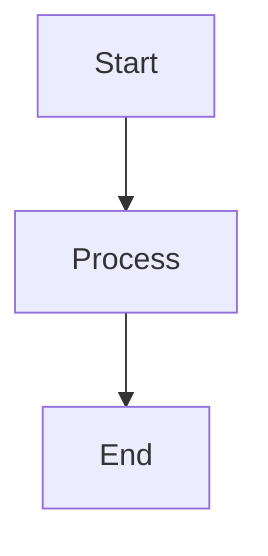

# Confluence MCP Usage Guide

This guide shows how to use the Confluence MCP server to publish markdown documentation to Confluence with professional styling and Mermaid diagram support.

## Quick Start

### 1. Start the MCP Server

```bash
npm run dev
# Server runs on http://localhost:3001
```

### 2. Configure Your Project

Use the `confluence_setup_project` tool with your specific configuration:

```json
{
  "confluenceUrl": "https://mycompany.atlassian.net/",
  "username": "john.doe@mycompany.com",
  "apiToken": "your-api-token",
  "spaceKey": "~123456789abcdef123456789abcdef123456789",
  "parentPageTitle": "Documentation Hub",
  "baseDir": "/Users/username/development/projects"
}
```

### 3. Test Connection

Use `confluence_test_connection` to verify your setup works.

### 4. Create Pages

Use `confluence_create_page` with markdown content - it will automatically:
- Use your configured space and parent page
- Convert markdown to professional Confluence format
- Render Mermaid diagrams as images
- Cache the mapping for future updates

## Available MCP Tools

### Configuration Tools

#### `confluence_setup_project`
Set up your Confluence project configuration.

**Parameters:**
- `confluenceUrl` (string): Your Confluence base URL
- `username` (string): Your Confluence username/email  
- `apiToken` (string): Your Confluence API token
- `spaceKey` (string): Default space key for pages
- `parentPageTitle` (string, optional): Parent page for organization
- `baseDir` (string, optional): Local file path mapping

**Example:**
```json
{
  "confluenceUrl": "https://mycompany.atlassian.net/",
  "username": "john.doe@mycompany.com",
  "apiToken": "ATATT3xFfGF0...",
  "spaceKey": "~123456789abcdef123456789abcdef123456789",
  "parentPageTitle": "Documentation Hub"
}
```

#### `confluence_show_config`
Display current project configuration.

#### `confluence_test_connection`
Test connectivity to your Confluence instance.

### Content Management Tools

#### `confluence_list_spaces`
List all available Confluence spaces.

#### `confluence_list_pages`
List pages in a specific space.

**Parameters:**
- `spaceKey` (string): The space key to list pages from

#### `confluence_create_page`
Create a new Confluence page from Markdown content.

**Parameters:**
- `title` (string): Page title
- `markdownContent` (string): Markdown content to convert
- `markdownPath` (string, optional): Local file path for caching
- `spaceKey` (string, optional): Override default space
- `parentPageId` (string, optional): Override default parent page

**Example:**
```json
{
  "title": "API Documentation",
  "markdownContent": "# API Docs\n\nThis is **bold** text...",
  "markdownPath": "./docs/api.md"
}
```

#### `confluence_update_page`
Update an existing Confluence page.

**Parameters:**
- `pageId` (string): ID of page to update
- `title` (string): New page title
- `markdownContent` (string): New markdown content
- `version` (number): Current page version number
- `markdownPath` (string, optional): Local file path for caching
- `parentPageId` (string, optional): Override default parent page

#### `confluence_delete_page`
Delete a Confluence page and remove from cache.

**Parameters:**
- `pageId` (string): ID of page to delete
- `markdownPath` (string, optional): Local file path to remove from cache

## Markdown Features

### Supported Elements

- **Headings** (H1-H6) with professional styling
- **Text formatting** (bold, italic, code)
- **Lists** (ordered and unordered, nested)
- **Tables** with professional borders and styling
- **Code blocks** with syntax highlighting
- **Blockquotes** converted to Confluence quote macros
- **Horizontal rules** with subtle styling
- **Links** (external and internal)

### Special Features

#### Mermaid Diagrams
```markdown

```

Automatically rendered as high-quality PNG images with professional styling.

#### Callouts
```markdown
> **Info:** This becomes an info panel in Confluence
> **Warning:** This becomes a warning panel
> **Tip:** This becomes a tip panel
```

#### Table of Contents
```markdown
[TOC]
```

Automatically generates a Confluence table of contents macro.

## Workflow Examples

### Publishing Documentation

1. **Setup once per project:**
   ```json
   confluence_setup_project({
     "confluenceUrl": "https://your-domain.atlassian.net/",
     "username": "your-email@domain.com",
     "apiToken": "your-token",
     "spaceKey": "your-space-key",
     "parentPageTitle": "Your Parent Page"
   })
   ```

2. **Create pages from markdown:**
   ```json
   confluence_create_page({
     "title": "Service Architecture",
     "markdownContent": "# Architecture\n\n...",
     "markdownPath": "./docs/architecture.md"
   })
   ```

3. **Update when markdown changes:**
   ```json
   confluence_update_page({
     "pageId": "123456",
     "title": "Service Architecture", 
     "markdownContent": "# Updated Architecture\n\n...",
     "version": 2,
     "markdownPath": "./docs/architecture.md"
   })
   ```

### Organizing Documentation

The MCP server supports hierarchical organization:

```
Parent Page (e.g., "Documentation Hub")
├── Service A Documentation
├── Service B Documentation
├── API Reference
└── Deployment Guide
```

All pages created will be organized under your configured parent page.

## Professional Styling

Pages are automatically styled with:

- **Modern typography** with proper spacing and line heights
- **Professional color scheme** using Confluence design tokens
- **Consistent formatting** for all elements
- **High-quality diagrams** with drop shadows and proper theming
- **Responsive layouts** that work on all devices

## Caching and Updates

The MCP server maintains a local cache (`confluence-project-config.json`) that:

- Links local markdown files to Confluence pages
- Tracks page IDs and versions for updates
- Enables smart updates when content changes
- Persists configuration across sessions

## Error Handling

The MCP server provides helpful error messages for:

- **Connection issues**: Clear troubleshooting steps
- **Authentication problems**: Token validation guidance  
- **Missing pages/spaces**: Lists available options
- **Version conflicts**: Current version information
- **Mermaid errors**: Fallback error displays

## Best Practices

1. **Use descriptive page titles** that reflect content hierarchy
2. **Organize with parent pages** for better navigation
3. **Include table of contents** for longer documents
4. **Use Mermaid diagrams** for visual explanations
5. **Test locally first** before publishing to Confluence
6. **Keep markdown files** in version control for history
7. **Use callouts** to highlight important information

## Troubleshooting

### Common Issues

1. **"Space not found"**: Check your space key format
2. **"Parent page not found"**: Verify parent page title exactly
3. **"Authentication failed"**: Regenerate your API token
4. **"Version conflict"**: Get current version with list_pages

### Getting Help

1. Use `confluence_test_connection` to verify setup
2. Use `confluence_show_config` to check configuration
3. Check server logs for detailed error messages
4. Verify permissions in Confluence web interface
