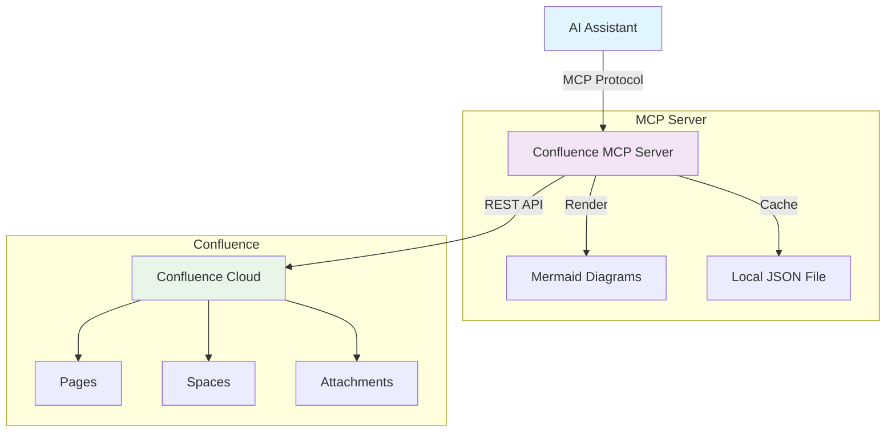
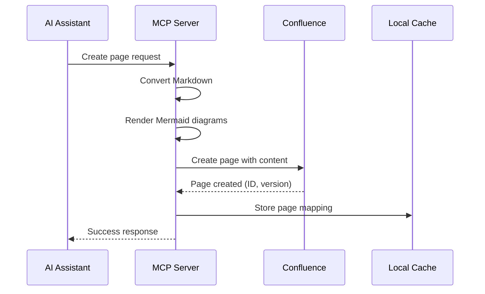

# Sample Documentation

This is an example markdown document that demonstrates the capabilities of the Confluence MCP server.

[TOC]

## Overview

This document shows how **markdown content** can be converted to *professionally styled* Confluence pages with support for:

- Code blocks with syntax highlighting
- Mermaid diagrams
- Tables
- Lists and formatting
- Callouts and info panels

## Code Examples

Here's a JavaScript code block:

```javascript
function greetUser(name) {
  console.log(`Hello, ${name}!`);
  return `Welcome to Confluence MCP`;
}

greetUser('Developer');
```

And a Python example:

```python
def calculate_fibonacci(n):
    if n <= 1:
        return n
    return calculate_fibonacci(n-1) + calculate_fibonacci(n-2)

# Generate first 10 Fibonacci numbers
for i in range(10):
    print(f"F({i}) = {calculate_fibonacci(i)}")
```

## Architecture Diagram

Here's a Mermaid diagram showing the system architecture:



## Process Flow



## Features Table

| Feature | Status | Description |
|---------|--------|-------------|
| Markdown Conversion | ✅ | Convert MD to Confluence format |
| Mermaid Diagrams | ✅ | Render as PNG images |
| Professional Styling | ✅ | Modern, clean layouts |
| Caching | ✅ | Link MD files to pages |
| SSE Support | ✅ | Real-time updates |
| Fly.io Ready | ✅ | Production deployment |

## Callouts

> **Info:** This is an informational callout that will be converted to a Confluence info macro.

> **Warning:** This is a warning callout that will be styled appropriately in Confluence.

> **Tip:** This is a tip callout for helpful information.

## Lists

### Unordered List
- First item
- Second item with **bold text**
- Third item with *italic text*
  - Nested item 1
  - Nested item 2
- Fourth item with `inline code`

### Ordered List
1. Step one
2. Step two
3. Step three
   1. Sub-step A
   2. Sub-step B
4. Step four

## Blockquote

> This is a blockquote that will be converted to a Confluence quote macro.
> It can span multiple lines and will maintain proper formatting.

## Horizontal Rule

---

## Conclusion

This example demonstrates the comprehensive markdown-to-Confluence conversion capabilities of the MCP server. The content will be professionally styled and include all the diagrams and formatting shown above.
